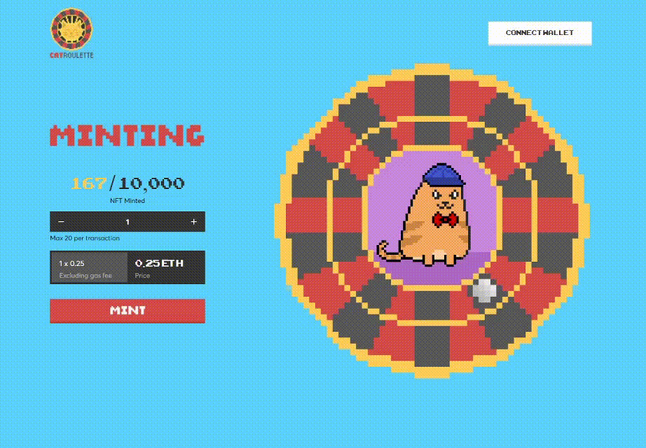

<h1 style="color: #44AEFB;display:flex;align-items:center">
<svg xmlns="http://www.w3.org/2000/svg" viewBox="0 0 448 512" style="&#10;    fill:#44AEFB;width: 25px;height: 25px;margin-right:5px"><path d="M224 16c-6.7 0-10.8-2.8-15.5-6.1C201.9 5.4 194 0 176 0c-30.5 0-52 43.7-66 89.4C62.7 98.1 32 112.2 32 128c0 14.3 25 27.1 64.6 35.9c-.4 4-.6 8-.6 12.1c0 17 3.3 33.2 9.3 48H45.4C38 224 32 230 32 237.4c0 1.7 .3 3.4 1 5l38.8 96.9C28.2 371.8 0 423.8 0 482.3C0 498.7 13.3 512 29.7 512H418.3c16.4 0 29.7-13.3 29.7-29.7c0-58.5-28.2-110.4-71.7-143L415 242.4c.6-1.6 1-3.3 1-5c0-7.4-6-13.4-13.4-13.4H342.7c6-14.8 9.3-31 9.3-48c0-4.1-.2-8.1-.6-12.1C391 155.1 416 142.3 416 128c0-15.8-30.7-29.9-78-38.6C324 43.7 302.5 0 272 0c-18 0-25.9 5.4-32.5 9.9c-4.8 3.3-8.8 6.1-15.5 6.1zm56 208H267.6c-16.5 0-31.1-10.6-36.3-26.2c-2.3-7-12.2-7-14.5 0c-5.2 15.6-19.9 26.2-36.3 26.2H168c-22.1 0-40-17.9-40-40V169.6c28.2 4.1 61 6.4 96 6.4s67.8-2.3 96-6.4V184c0 22.1-17.9 40-40 40zm-88 96l16 32L176 480 128 288l64 32zm128-32L272 480 240 352l16-32 64-32z"/></svg>
  Vladimir Korzhov
</h1>

  I am a passionate, athletic, frontend software developer. I am open minded person, who thinks about user experience first, actively proposing options to improve it. I love to learn and I am never afraid of complex tasks and challenges. Team work is one of my best sides, as I really like to explore different opinions and come to a common agreement.
 
 

[Email Me](mailto:korgov.vova@icloud.com)

    
 
<!-- Languages and Tools -->

<h2 style="color: #44AEFB">⚙️ Languages and Tools</h2>

     

    
<!-- Icons Resources -->
<!-- https://devicon.dev/ -->
<!-- https://cdn.jsdelivr.net/npm/simple-icons@v3/icons/ -->

  
  
  
  
    
  
  
  
  
  <a href="https://soliditylang.org/" target="_blank" rel="noreferrer">
      <svg xmlns="http://www.w3.org/2000/svg" width="60px" height="60px" viewBox="0 0 32 32"><title>file_type_solidity</title><path d="M20.477,2l-4.5,8h-9l4.5-8h9" style="fill:#c1c1c1;opacity:0.45;isolation:isolate"/><path d="M11.52,30l4.5-8h9l-4.5,8h-9" style="fill:#c1c1c1;opacity:0.45;isolation:isolate"/><path d="M15.975,10h9l-4.5-8h-9Z" style="fill:#c1c1c1;opacity:0.6;isolation:isolate"/><path d="M16.022,22h-9l4.5,8h9Z" style="fill:#c1c1c1;opacity:0.6;isolation:isolate"/><path d="M11.477,18l4.5-8-4.5-8-4.5,8Z" style="fill:#c1c1c1;opacity:0.8;isolation:isolate"/><path d="M20.52,14l-4.5,8,4.5,8,4.5-8Z" style="fill:#c1c1c1;opacity:0.8;isolation:isolate"/></svg>
  </a>
  
  
  <a href="https://www.netlify.com/" target="_blank" rel="noreferrer">
<svg xmlns="http://www.w3.org/2000/svg" width="45px" height="45px" viewBox="0 0 40 40">
  <defs>
    <radialGradient id="a" cy="0%" r="100.11%" fx="50%" fy="0%" gradientTransform="matrix(0 .9989 -1.152 0 .5 -.5)">
      <stop offset="0%" stop-color="#20C6B7"/>
      <stop offset="100%" stop-color="#4D9ABF"/>
    </radialGradient>
  </defs>
  <path fill="url(#a)" d="M28.589 14.135l-.014-.006c-.008-.003-.016-.006-.023-.013a.11.11 0 0 1-.028-.093l.773-4.726 3.625 3.626-3.77 1.604a.083.083 0 0 1-.033.006h-.015c-.005-.003-.01-.007-.02-.017a1.716 1.716 0 0 0-.495-.381zm5.258-.288l3.876 3.876c.805.806 1.208 1.208 1.355 1.674.022.069.04.138.054.209l-9.263-3.923a.728.728 0 0 0-.015-.006c-.037-.015-.08-.032-.08-.07 0-.038.044-.056.081-.071l.012-.005 3.98-1.684zm5.127 7.003c-.2.376-.59.766-1.25 1.427l-4.37 4.369-5.652-1.177-.03-.006c-.05-.008-.103-.017-.103-.062a1.706 1.706 0 0 0-.655-1.193c-.023-.023-.017-.059-.01-.092 0-.005 0-.01.002-.014l1.063-6.526.004-.022c.006-.05.015-.108.06-.108a1.73 1.73 0 0 0 1.16-.665c.009-.01.015-.021.027-.027.032-.015.07 0 .103.014l9.65 4.082zm-6.625 6.801l-7.186 7.186 1.23-7.56.002-.01c.001-.01.003-.02.006-.029.01-.024.036-.034.061-.044l.012-.005a1.85 1.85 0 0 0 .695-.517c.024-.028.053-.055.09-.06a.09.09 0 0 1 .029 0l5.06 1.04zm-8.707 8.707l-.81.81-8.955-12.942a.424.424 0 0 0-.01-.014c-.014-.019-.029-.038-.026-.06.001-.016.011-.03.022-.042l.01-.013c.027-.04.05-.08.075-.123l.02-.035.003-.003c.014-.024.027-.047.051-.06.021-.01.05-.006.073-.001l9.921 2.046a.164.164 0 0 1 .076.033c.013.013.016.027.019.043a1.757 1.757 0 0 0 1.028 1.175c.028.014.016.045.003.078a.238.238 0 0 0-.015.045c-.125.76-1.197 7.298-1.485 9.063zm-1.692 1.691c-.597.591-.949.904-1.347 1.03a2 2 0 0 1-1.206 0c-.466-.148-.869-.55-1.674-1.356L8.73 28.73l2.349-3.643c.011-.018.022-.034.04-.047.025-.018.061-.01.091 0a2.434 2.434 0 0 0 1.638-.083c.027-.01.054-.017.075.002a.19.19 0 0 1 .028.032L21.95 38.05zM7.863 27.863L5.8 25.8l4.074-1.738a.084.084 0 0 1 .033-.007c.034 0 .054.034.072.065a2.91 2.91 0 0 0 .13.184l.013.016c.012.017.004.034-.008.05l-2.25 3.493zm-2.976-2.976l-2.61-2.61c-.444-.444-.766-.766-.99-1.043l7.936 1.646a.84.84 0 0 0 .03.005c.049.008.103.017.103.063 0 .05-.059.073-.109.092l-.023.01-4.337 1.837zM.831 19.892a2 2 0 0 1 .09-.495c.148-.466.55-.868 1.356-1.674l3.34-3.34a2175.525 2175.525 0 0 0 4.626 6.687c.027.036.057.076.026.106-.146.161-.292.337-.395.528a.16.16 0 0 1-.05.062c-.013.008-.027.005-.042.002H9.78L.831 19.891zm5.68-6.403l4.491-4.491c.422.185 1.958.834 3.332 1.414 1.04.44 1.988.84 2.286.97.03.012.057.024.07.054.008.018.004.041 0 .06a2.003 2.003 0 0 0 .523 1.828c.03.03 0 .073-.026.11l-.014.021-4.56 7.063c-.012.02-.023.037-.043.05-.024.015-.058.008-.086.001a2.274 2.274 0 0 0-.543-.074c-.164 0-.342.03-.522.063h-.001c-.02.003-.038.007-.054-.005a.21.21 0 0 1-.045-.051l-4.808-7.013zm5.398-5.398l5.814-5.814c.805-.805 1.208-1.208 1.674-1.355a2 2 0 0 1 1.206 0c.466.147.869.55 1.674 1.355l1.26 1.26-4.135 6.404a.155.155 0 0 1-.041.048c-.025.017-.06.01-.09 0a2.097 2.097 0 0 0-1.92.37c-.027.028-.067.012-.101-.003-.54-.235-4.74-2.01-5.341-2.265zm12.506-3.676l3.818 3.818-.92 5.698v.015a.135.135 0 0 1-.008.038c-.01.02-.03.024-.05.03a1.83 1.83 0 0 0-.548.273.154.154 0 0 0-.02.017c-.011.012-.022.023-.04.025a.114.114 0 0 1-.043-.007l-5.818-2.472-.011-.005c-.037-.015-.081-.033-.081-.071a2.198 2.198 0 0 0-.31-.915c-.028-.046-.059-.094-.035-.141l4.066-6.303zm-3.932 8.606l5.454 2.31c.03.014.063.027.076.058a.106.106 0 0 1 0 .057c-.016.08-.03.171-.03.263v.153c0 .038-.039.054-.075.069l-.011.004c-.864.369-12.13 5.173-12.147 5.173-.017 0-.035 0-.052-.017-.03-.03 0-.072.027-.11a.76.76 0 0 0 .014-.02l4.482-6.94.008-.012c.026-.042.056-.089.104-.089l.045.007c.102.014.192.027.283.027.68 0 1.31-.331 1.69-.897a.16.16 0 0 1 .034-.04c.027-.02.067-.01.098.004zm-6.246 9.185l12.28-5.237s.018 0 .035.017c.067.067.124.112.179.154l.027.017c.025.014.05.03.052.056 0 .01 0 .016-.002.025L25.756 23.7l-.004.026c-.007.05-.014.107-.061.107a1.729 1.729 0 0 0-1.373.847l-.005.008c-.014.023-.027.045-.05.057-.021.01-.048.006-.07.001l-9.793-2.02c-.01-.002-.152-.519-.163-.52z"/>
</svg>
  </a>

 
 

<!-- Latest YouTube Videos -->

<h2 style="color: #44AEFB;display:flex;align-items:center">
  <svg xmlns="http://www.w3.org/2000/svg" style="margin-right: 10px" width="20px" height="20px" fill="#44AEFB" viewBox="0 0 512 512"><path d="M184 48H328c4.4 0 8 3.6 8 8V96H176V56c0-4.4 3.6-8 8-8zm-56 8V96H64C28.7 96 0 124.7 0 160v96H192 320 512V160c0-35.3-28.7-64-64-64H384V56c0-30.9-25.1-56-56-56H184c-30.9 0-56 25.1-56 56zM512 288H320v32c0 17.7-14.3 32-32 32H224c-17.7 0-32-14.3-32-32V288H0V416c0 35.3 28.7 64 64 64H448c35.3 0 64-28.7 64-64V288z"/></svg>
  Portfolio
</h2>
 

  <a href="https://aurora.reachire.com/">
    
    <h2 style="color: #fff;text-align:center">Aurora (social network)</h2>
  </a>
   
  

    
    <h2 style="color: #fff;text-align:center">OneSeed (web3 dApp)</h2>
  

   
  <a href="https://thirsty-noyce-eebf1a.netlify.app">
    
    <h2 style="color: #fff;text-align:center">Cat Roulette (frontend)</h2>
  </a>
   
  <a href="https://lucid-heisenberg-50986a.netlify.app">
    
    <h2 style="color: #fff;text-align:center">Sensei Shib (frontend)</h2>
  </a>
   
  <a href="https://upbeat-wing-9fc17f.netlify.app/">
    
    <h2 style="color: #fff;text-align:center">Quokka (frontend)</h2>
  </a>

 

<!-- Begin Footer -->
<!-- Icons Resources -->
<!-- https://devicon.dev/ -->

    
    

<!-- End Footer -->